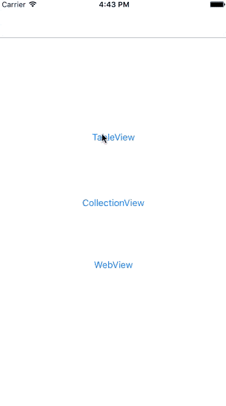

# HUScrollableNavigationController
此控件是从目前开发的一款APP中分离出来的，模仿了 Facebook iOS APP 滚动内容时，导航条也跟随滚动的效果。

## 预览



## 安装
1. 把HUScrollableNavigationController.h和HUScrollableNavigationController.m拖入你的工程中；

2. `#import "HUScrollableNavigationController.h"`;

## 使用
###配置
使用`HUScrollableNavigationController`替代UIKit的`UINavigationController`。
并在以下方法中进行配置。
```objective-c
- (void)viewDidAppear:(BOOL)animated {
    [super viewDidAppear:animated];
    [(HUScrollableNavigationController *)self.navigationController observeScrollView:self.tableView forDelayDistance:10];
}

- (void)viewWillDisappear:(BOOL)animated {
    [super viewWillDisappear:animated];
    [(HUScrollableNavigationController *)self.navigationController showNavigationBarWithAnimation:YES];
}

- (void)viewDidDisappear:(BOOL)animated {
    [super viewDidDisappear:animated];
    [(HUScrollableNavigationController *)self.navigationController stopObserveScrollView];
}

- (BOOL)scrollViewShouldScrollToTop:(UIScrollView *)scrollView {
    [(HUScrollableNavigationController *)self.navigationController showNavigationBarWithAnimation:YES];
    return true;
}
```
### 监听导航条状态和滚动进度
1. 设置代理

```objective-c
((HUScrollableNavigationController *)self.navigationController).navigationBarScrollDelegate = self;
```
2. 实现代理方法，监听进度和状态来实现一些动画

```objective-c
// 监听滚动状态
- (void)navigationController:(HUScrollableNavigationController * _Nonnull)navigationController didChangeNavigationBarState:(NavigationBarState)state;
// 监听滚动进度
- (void)navigationController:(HUScrollableNavigationController * _Nonnull)navigationController didScrollWithProgress:(CGFloat)progress;
```

## Thanks
感谢`andreamazz`的 [AMScrollingNavbar](https://github.com/andreamazz/AMScrollingNavbar "AMScrollingNavbar")提供的思路。

## Copyright & License
Copyright (c) 2016 枫之楚

Permission is hereby granted, free of charge, to any person obtaining a copy
of this software and associated documentation files (the "Software"), to deal
in the Software without restriction, including without limitation the rights
to use, copy, modify, merge, publish, distribute, sublicense, and/or sell
copies of the Software, and to permit persons to whom the Software is
furnished to do so, subject to the following conditions:

The above copyright notice and this permission notice shall be included in all
copies or substantial portions of the Software.

THE SOFTWARE IS PROVIDED "AS IS", WITHOUT WARRANTY OF ANY KIND, EXPRESS OR
IMPLIED, INCLUDING BUT NOT LIMITED TO THE WARRANTIES OF MERCHANTABILITY,
FITNESS FOR A PARTICULAR PURPOSE AND NONINFRINGEMENT. IN NO EVENT SHALL THE
AUTHORS OR COPYRIGHT HOLDERS BE LIABLE FOR ANY CLAIM, DAMAGES OR OTHER
LIABILITY, WHETHER IN AN ACTION OF CONTRACT, TORT OR OTHERWISE, ARISING FROM,
OUT OF OR IN CONNECTION WITH THE SOFTWARE OR THE USE OR OTHER DEALINGS IN THE
SOFTWARE.
